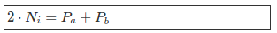
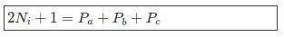
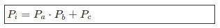

# Conjetura Numeros Primos

## Reglas

Usando las siguientes 3 reglas se puede generar el conjuntos de Numeros Enteros [\math{N}] y su subconjunto de Numeros Primos \math{P}

### Basics

- P_i: Numero Primo perteneciente al conjunto \math{P} 
- P_a: Numero Primo perteneciente al conjunto \math{P} 
- P_b: Numero Primo perteneciente al conjunto \math{P} 
- P_c: Numero Primo perteneciente al conjunto \math{P} 
- N_i: Numero Entero perteneciente al conjunto \math{N} 

### Regla 1: Conjetura fuerte de Goldbach

Todo Numero Par mayor a 2 puede ser expresado como la suma de 2 Numeros Primos.

<!---(2N_i=P_a + P_b)-->

### Regla 2: Conjetura debil de Goldbach

Todo Numero Impar mayor a 5 puede ser expresado como la suma de 3 Numeros Primos.

<!---(2N_i+1=P_a + P_b + P_c)-->

### Regla 3: Conjetura simple de Yaksic

Todo Numero Primo mayor a 5 puede ser expresado como la multiplicacion de 2 Numeros Primos y la adicion de un Tercer Numero Primo.

<!---(P_i=P_a \cdot P_b + P_c)-->

